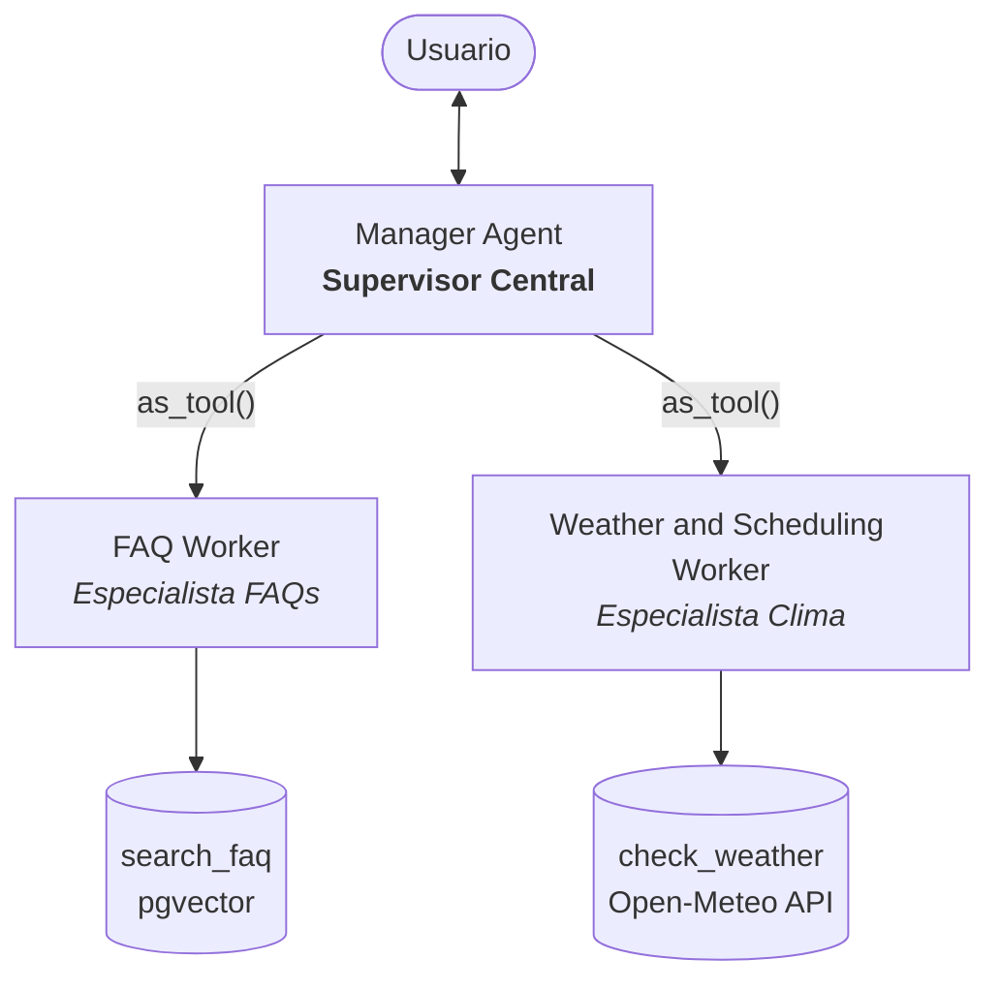
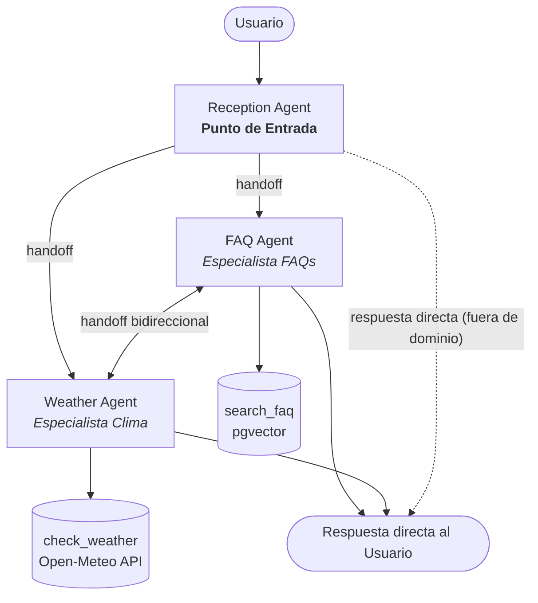
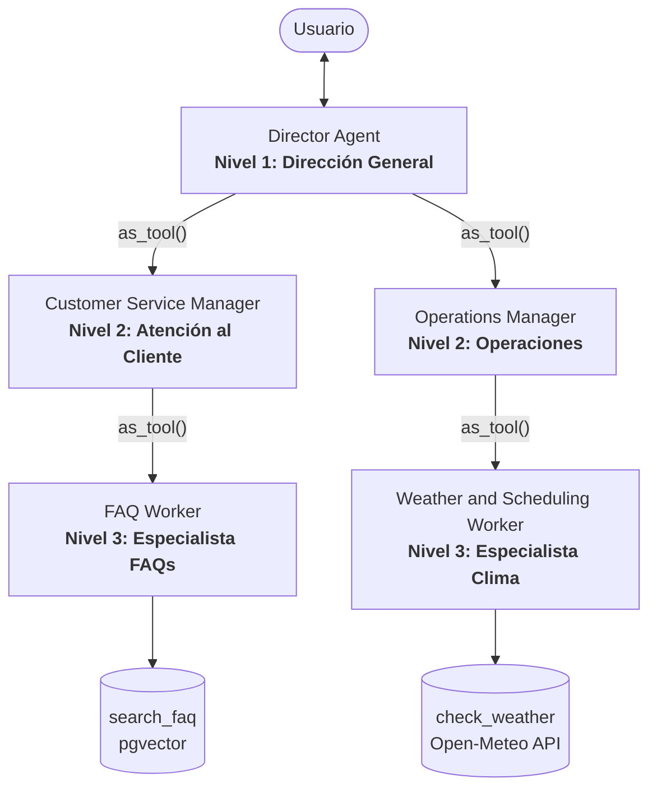

# Comparativa de Arquitecturas Multiagente — Parachute S.A.

Este documento presenta el diseño y organización de los agentes para el asistente de **Parachute S.A.** bajo tres arquitecturas distintas, independientes entre sí, resolviendo el mismo caso de uso: atención de preguntas frecuentes (FAQs) y evaluación meteorológica de fechas para saltos en paracaídas.

---

## 1. Arquitectura Centralizada (`agent_centralized.py`)

### Explicación
- **Qué es:** Un único agente supervisor o coordinador central recibe todos los mensajes del usuario, decide a qué agente especialista consultar invocándolo como una herramienta (`as_tool()`) y redacta la respuesta final al usuario.
- **Cómo se usó en el programa:**
  - El usuario interactúa exclusivamente con el `Manager Agent`.
  - El `Manager Agent` posee a `FAQ Worker` y `Weather and Scheduling Worker` envueltos como herramientas (`as_tool()`).
  - Los workers ejecutan sus herramientas respectivas (`search_faq` y `check_weather`) y devuelven el resultado al manager, quien formula la respuesta final.

### Diagrama

---

## 2. Arquitectura Descentralizada (`agent_decentralized.py`)

### Explicación
- **Qué es:** No existe un supervisor central que recolecte respuestas. Los agentes transfieren el control total de la conversación de forma horizontal mediante delegaciones explícitas (`handoffs`), y el especialista que recibe el control responde directamente al usuario.
- **Cómo se usó en el programa:**
  - `Reception Agent` actúa como punto de entrada sin herramientas: clasifica la intención y transfiere el control mediante `handoff` a `FAQ Agent` o `Weather Agent` (o responde amablemente si está fuera de alcance).
  - El especialista activo conserva el control, ejecuta su herramienta (`search_faq` o `check_weather`) y responde directamente al usuario.
  - Si la intención del usuario cambia durante la conversación, `FAQ Agent` y `Weather Agent` pueden transferirse mutuamente el control.

### Diagrama

---

## 3. Arquitectura Jerárquica (`agent_jerarquico.py`)

### Explicación
- **Qué es:** Estructura organizativa en árbol con múltiples niveles y cadena de mando estricta. Un nivel directivo delega responsabilidades a gerentes o managers departamentales, y estos a su vez coordinan a los especialistas técnicos (workers).
- **Cómo se usó en el programa:**
  - **Nivel 1 (Dirección):** `Director Agent` recibe la solicitud y la delega al departamento correspondiente vía `as_tool()`.
  - **Nivel 2 (Gerencias Departamentales):** `Customer Service Manager` y `Operations Manager` reciben la tarea y la delegan a su worker especializado vía `as_tool()`.
  - **Nivel 3 (Workers Especialistas):** `FAQ Worker` y `Weather and Scheduling Worker` ejecutan las herramientas técnicas (`search_faq` y `check_weather`) y devuelven el resultado hacia arriba por la cadena de mando.

### Diagrama

