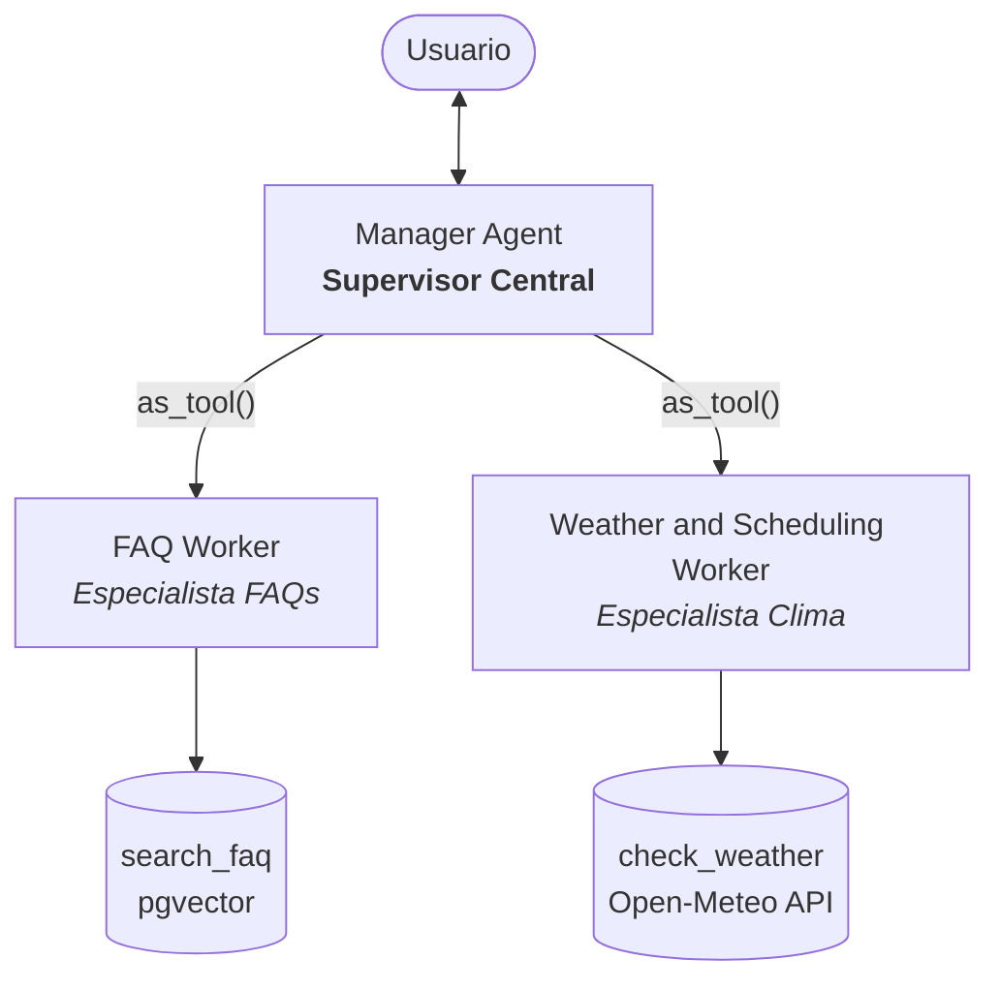

# Comparativa de Arquitecturas Multiagente — Parachute S.A.

Este documento presenta el diseño y organización de los agentes para el asistente de **Parachute S.A.** bajo la arquitectura centralizada, que resuelve el caso de uso: atención de preguntas frecuentes (FAQs) y evaluación meteorológica de fechas para saltos en paracaídas.

---

## Arquitectura Centralizada (`agent_centralized.py`)

### Explicación
- **Qué es:** Un único agente supervisor o coordinador central recibe todos los mensajes del usuario, decide a qué agente especialista consultar invocándolo como una herramienta (`as_tool()`) y redacta la respuesta final al usuario.
- **Cómo se usó en el programa:**
  - El usuario interactúa exclusivamente con el `Manager Agent`.
  - El `Manager Agent` posee a `FAQ Worker` y `Weather and Scheduling Worker` envueltos como herramientas (`as_tool()`).
  - Los workers ejecutan sus herramientas respectivas (`search_faq` y `check_weather`) y devuelven el resultado al manager, quien formula la respuesta final.

### Diagrama

```mermaid
flowchart TD
    User([Usuario]) <--> Manager[Manager Agent<br><b>Supervisor Central</b>]
    
    Manager -- as_tool() --> FAQ[FAQ Worker<br><i>Especialista FAQs</i>]
    Manager -- as_tool() --> Weather[Weather and Scheduling Worker<br><i>Especialista Clima</i>]
    
    FAQ --> ToolFAQ[(search_faq<br>pgvector)]
    Weather --> ToolWeather[(check_weather<br>Open-Meteo API)]
```
